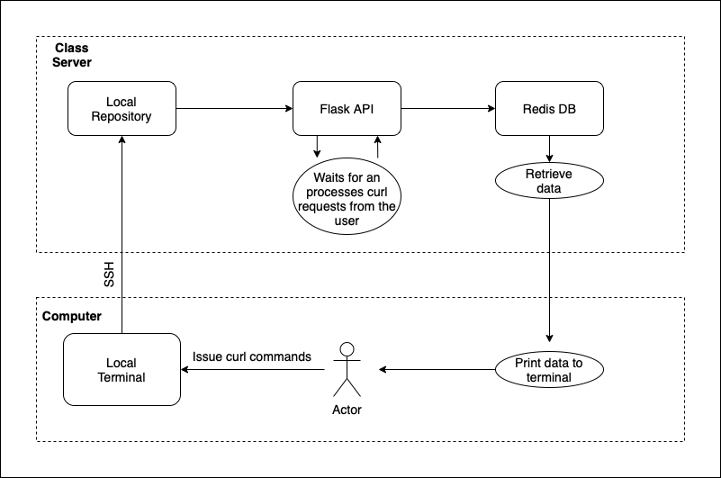

# Diagram Visualization for ISS Positional and Sightings Data Application

The diagram above illustrates the cycle of the ISS Positional and Sightings Data Application. First, the user issues curl commands on their local terminal. Those commands are then sent to the class server via ssh where they are received by the Flask server. Once the server has the request, the data requested will be retrieved from the Redis database which will then be displayed on the terminal for the user to see.
